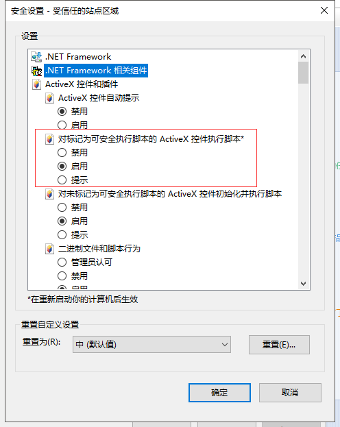

### **准备工作：** 

开发环境  
安装包： vs,mssql,plm  
iis 配置

### **注意事项：** 

仅支持ie9及下
浏览器的相关配置  


```
相关数据结构：
//PDM对象类型
public enum ObjectOption
{
    /// <summary>
    /// 文档0
    /// </summary>
    Document = 0,
    /// <summary>
    /// 物料1
    /// </summary>
    Materiel = 1,
    /// <summary>
    /// 项目2
    /// </summary>
    Project = 2,
    /// <summary>
    /// 任务3
    /// </summary>
    Task = 3,
    /// <summary>
    /// 设备4
    /// </summary>
    Equipment = 4,
    /// <summary>
    /// 业务表单5
    /// </summary>
    BusinessBase = 5,
    /// <summary>
    /// 设计变更6
    /// </summary>
    EngineeringChange = 6,
    /// <summary>
    /// 问题集7
    /// </summary>
    Question = 7,
    /// <summary>
    /// 邮件8
    /// </summary>
    Mail = 8,
    /// <summary>
    /// 工序10
    /// </summary>
    Process = 10,
    /// <summary>
    /// PBOM11
    /// </summary>
    PBOM = 11,
    /// <summary>
    /// 工步12
    /// </summary>
    ProcessStep = 12,
    /// <summary>
    /// 工装
    /// </summary>
    Tool = 13,
    /// <summary>
    /// 流程表单16
    /// </summary>
    FlowBase = 16,
    /// <summary>
    /// 业务表单模板17
    /// </summary>
    BusinessBaseTemplate = 17,
    /// <summary>
    /// 项目变更
    /// </summary>
    ProjectChange = 18,
    /// <summary>
    /// 物料申请单
    /// </summary>
    ApplicationForm = 19,

    /// <summary>
    /// BOM扩展属性
    /// </summary>
    BomExpansion = 20,
    /// <summary>
    /// 驱动表单
    /// </summary>
    DriverForm = 21,
    /// <summary>
    /// 属性变更单
    /// </summary>
    UpdateForm = 22,
    /// <summary>
    /// ECR
    /// </summary>
    ECR = 23,
    /// <summary>
    /// 用户24
    /// </summary>
    User = 24,
    /// <summary>
    /// 客户需求25
    /// </summary>
    CustmorRequest = 25,
    /// <summary>
    /// 交付
    /// </summary>
    Delivery = 26,
    /// <summary>
    /// 客户
    /// </summary>
    Customer = 91,
    /// <summary>
    /// 供应商
    /// </summary>
    Supplier = 92,
    /// <summary>
    /// 客户链接
    /// </summary>
    Customerlink = 911,
    /// <summary>
    /// 供应商链接
    /// </summary>
    Supplierlink = 921,

    /// <summary>
    ///  報價管理
    /// </summary>
    Quote = 28,

    /// <summary>
    /// 工艺路线
    /// </summary>
    Routing = 29,
    /// <summary>
    /// 工艺路线与工序关系
    /// </summary>
    RoutingOper = 291,

    /// <summary>
    /// 工序
    /// </summary>
    Oper = 292,

    /// <summary>
    /// 工作中心
    /// </summary>
    WorkCenter = 293,

    /// <summary>
    /// ERP用的BOM
    /// </summary>
    BOM = 1000,

    /// <summary>
    /// ERP用的BOM项
    /// </summary>
    BOMItems = 2000,

    /// <summary>
    /// ERP用的替代料类型
    /// </summary>
    Substitue=1001,

    /// <summary>
    /// 替代件项
    /// </summary>
    SubstitueItems = 2001,

    /// <summary>
    /// PBOM项
    /// </summary>
    PBOMItems = 2011,

    /// <summary>
    /// PBOM表体中 物料与工序的关系
    /// </summary>
    PBOMItemOpers = 2012 ,

    /// <summary>
    /// DBOM
    /// </summary>
    DBOM = 14,
    /// <summary>
    /// DBOM项
    /// </summary>
    DBOMItems = 2021,
    /// <summary>
    /// 2D图纸BOM过滤设置
    /// </summary>
    DrawingBOMFilter = 2015
}


```

#### **根据流程表单id查找流程对象的方法:**  
```

//方法路径
//Proway.PLM.FlowBase.WFObjectManager.SearchWFObjectByObjId,Proway.PLM.BLL

/// <summary>
/// 据对象ID找出流程表单的流程对象
/// </summary>
/// <param name="ObjectId"></param>
/// <param name="ObjectOption"></param>
/// <returns></returns>
public IList SearchWFObjectByObjId(string ObjectId, Proway.PLM.Settings.ObjectOption ObjectOption)
{
    return access.SearchWFObjectByObjId(ObjectId, ObjectOption);
}
```


#### **关键应用程序的标识：**  
>A1001：外挂插件  
A1060：ERP数据同步检测  
A1061：ERP数据同步  

#### **实现方案：** 
1. 新建一个webservice程序（独立部署）  
2. webservice添加一个方法（名称自定义，但是需要可以远程调用）；方法如下：  
```
/// <summary>
/// 同步数据到ERP
/// </summary>
/// <param name="BaseId">流程表单id</param>
/// <param name="UserCode">用户编码</param>
/// <returns>有错返回字符串错误信息，成功返回空字符串</returns>
public string SynchronizeData(string BaseId, string UserCode);
```
3. 在PLM的插件表：*Sys_Plugin*里面添加一条记录
```
--插件表结构
CREATE TABLE [dbo].[Sys_Plugin] (
    [PluginId]    VARCHAR (40)   NOT NULL,
    [PluginName]  NVARCHAR (100) NOT NULL,
    [ServiceType] INT            NOT NULL COMMENT '服务的类型，1：webservice',
    [ExecutePath] NVARCHAR (200) NOT NULL COMMENT 'webservice的路径',
    [ExecuteType] NVARCHAR (50)  NOT NULL COMMENT '执行类型,空字符串即可',
    [ExecuteFunc] NVARCHAR (50)  NOT NULL COMMENT 'wenservice执行的函数的名称，前面例子就是:SynchronizeData',
    [BindType]    INT            NULL COMMENT '绑定的PDM对象的类型，填写1（物料即可）',
    [Creator]     VARCHAR (40)   NOT NULL,
    [CreateDate]  VARCHAR (20)   NOT NULL,
    [Remark]      NVARCHAR (500) NULL,
    CONSTRAINT [PK_SYS_PLUGIN] PRIMARY KEY CLUSTERED ([PluginId] ASC)
);
```
插入数据如下：


4. 在BOM变更的流程中的审核节点的添加应用程序，应用程序为执行插件。插件为第三步添加的插件
